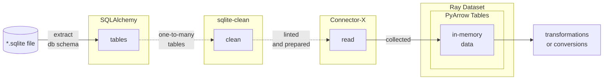
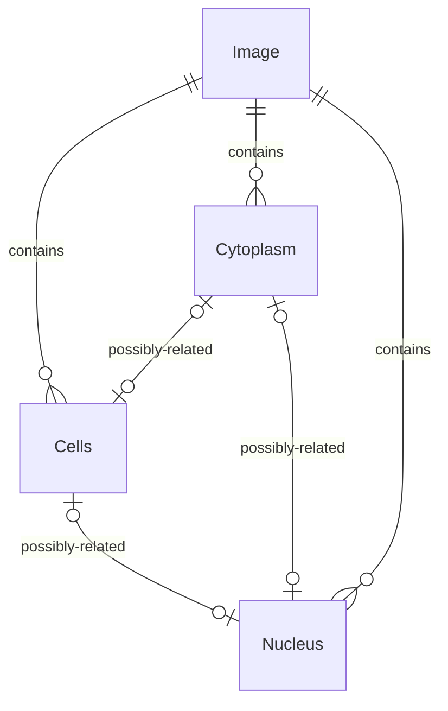

# Sketches for cytomining/pyctominer#205

__Goal:__
convert SQLite database files to another format for use within `pycytominer` to avoid performance and other challenges associated with existing file format or data. We're seeking performance improvements in addition to possible uniformity and consistency when handling this data - especially at scale.

## Diagrams

__Working Architecture Sketch__



References from [cytomining/pyctominer#195](https://github.com/cytomining/pycytominer/issues/195)

__General Flow__


__Arrow Basis__


## Rough Steps

1. File-based database to in-mem
    1. Take input as SQLite path or engine connection (SQLAlchemy) + optional schema specification(?)
    1. Build or utilize engine for connecting to database (SQLAlchemy)
    1. Lint for mismatching affinity vs storage class types for performance needs. (Linting lib?)
        1. If detecting issue, resolve...
            - nan str's to NULL (enable nullable columns)
            - other inferenced majority datatypes?
    1. SQLite read into "core" memory format (Arrow)
        1. Read SQLite schema for tables (SQLAlchemy)
        1. Read each table within schema as in-mem tables (Connector-X)
            - Chunking?
        1. Confirm or validate schema within tables (?)
        1. Return set of tables as result (one to many)
    1. (optional, maybe args?) Further conversion from table to dataframe?
        1. Pandas
        1. Modin
        1. Others?
1. In-mem to File-based Conversion
    1. Read set of in-mem tables (one to many)
    1. Group tables together as new translated SQLite schema (?)
    1. Write to database
    1. Return path of database

## Questions

- What to do with virtual tables?
- What to do with relationships?
- What are the schema expectations for pycytominer and how may we define these upfront?
- How may merges and other transformational work take place in an efficiently scaled way?
- How might one take advantage of greater compute capabilities if it were available (while assuming default-case local/portable)?
- How can we parallelize to scale further than local/native formats may currently allow?

## Data Type Mapping

Explicitly map SQLite datatypes to Arrow types. Build from or expand upon actuals discovered within similar documentation <https://github.com/sfu-db/connector-x/blob/main/docs/databases/sqlite.md>.

Reference:

- <https://www.sqlite.org/datatype3.html>
- <https://arrow.apache.org/docs/python/api/datatypes.html>

Data Types Reference Table:
SQLite Type | Arrow Type
--- | ---
INTEGER | INT64
REAL | DOUBLE
TEXT | STRING
BLOB | LARGE_BINARY
NULL | NA

## Schema Specification

Schema may be explicitly specified via [Arrow schema](https://arrow.apache.org/docs/python/generated/pyarrow.schema.html).

### Images, Cells, Nucleus, Cytoplasm

Indexes:

- TableNumber
- ImageNumber
- ObjectNumber (potentially unique per biological compartment)

Linking Objects for Biological Compartments:

```python
{
    "cytoplasm": {
        "cells": "Cytoplasm_Parent_Cells",
        "nuclei": "Cytoplasm_Parent_Nuclei",
    },
    "cells": {"cytoplasm": "ObjectNumber"},
    "nuclei": {"cytoplasm": "ObjectNumber"},
}
```

Working Entity Relationship Diagram:



Working tabular relationship between the compartments:

TableNumber | ImageNumber | Cytoplasm_ObjectNumber | Cells_ObjectNumber | Nucleus_ObjectNumber | Image_Fields...(many) | Cytoplasm_Fields...(many) | Cells_Fields...(many) | Nucleus_Fields...(many)
--- | --- | --- | --- | --- | --- | --- | --- | ---
STRING (Not null) | INT64 (Not null) | INT64 (Nullable)| INT64 (Nullable)| INT64 (Nullable) | Various (Populated for all ..._ObjectNumber == Null) | Various (Cytoplasm_ObjectNumber != Null) | Various (Cells_ObjectNumber != Null) | Various (Nucleus_ObjectNumber != Null)

Example:

TableNumber | ImageNumber | Cytoplasm_ObjectNumber | Cells_ObjectNumber | Nucleus_ObjectNumber | Image_Fields...(many) | Cytoplasm_Fields...(many) | Cells_Fields...(many) | Nucleus_Fields...(many)
--- | --- | --- | --- | --- | --- | --- | --- | ---
123abc | 1 | Null | Null| Null | Image Data... | Null | Null | Null
123abc | 1 | 1 | Null| Null | Null | Cytoplasm Data... | Null | Null
123abc | 1 | Null | 1| Null | Null | Null | Cells Data... | Null
123abc | 1 | Null | Null | 1 | Null | Null | Null | Nucleus Data...
